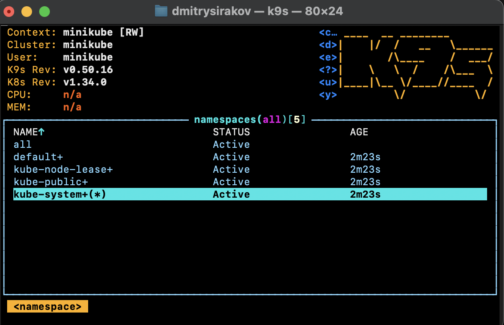
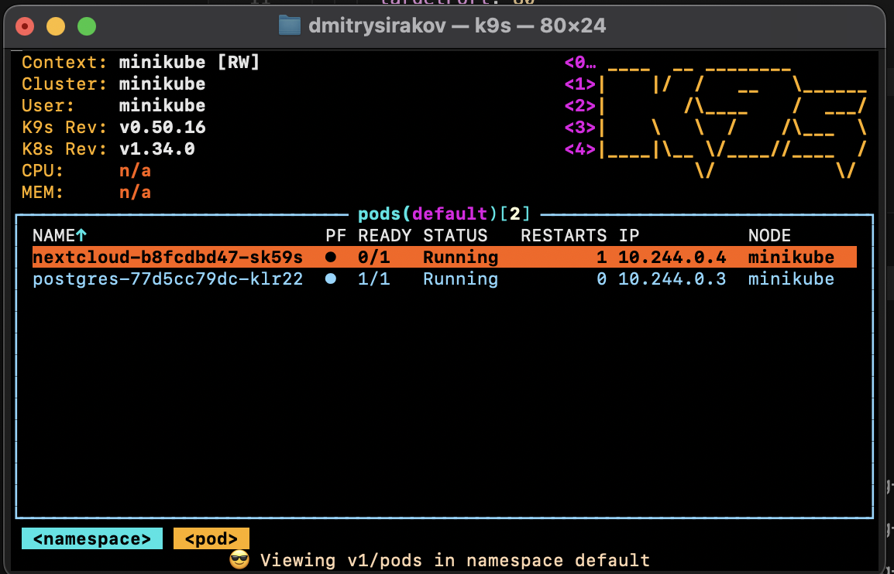
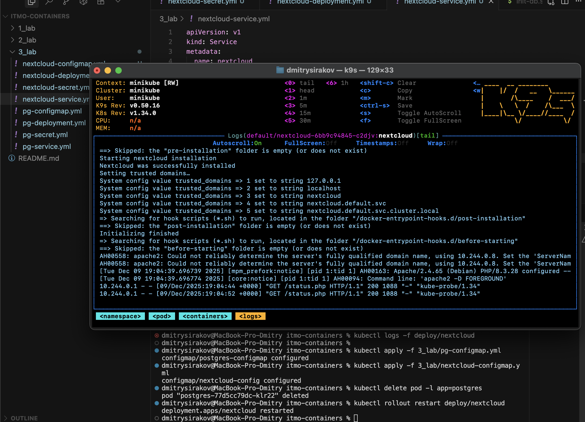
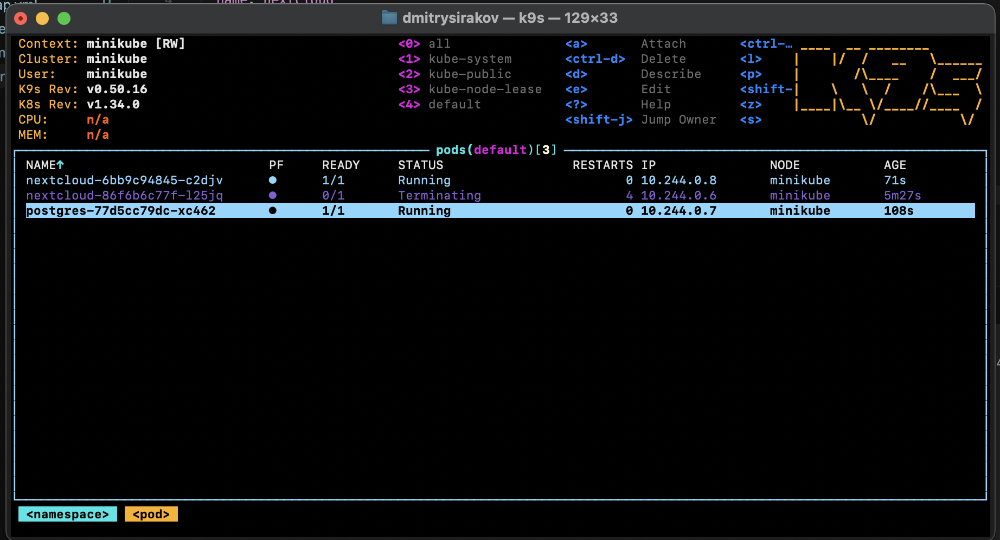
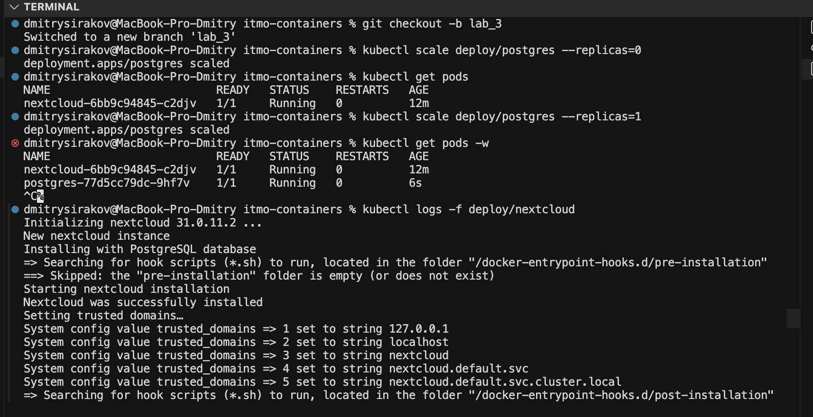

# ЛР 3 — Kubernetes (minikube, Nextcloud + PostgreSQL)

## Ответы на вопросы
1) Важен ли порядок применения манифестов?  

   Да, логически сначала зависимости (ConfigMap/Secret), затем Service/Deployment. Если деплой подтянет env из несуществующего CM/Secret, под упадёт. Можно давать все сразу `kubectl apply -f .` — kube применит, но безопаснее соблюдать порядок.

2) Что будет при скейле postgres-deployment в 0 → 1 и повторном заходе в Nextcloud? Почему?  

   - Без PVC данные БД теряются: при `replicas=0` под удаляется вместе с данными, при `1` под поднимется пустой, Nextcloud запросит повторную инициализацию или выдаст ошибку подключения.  
   
   - С PVC данные сохранятся; на время даунтайма Nextcloud будет не готов (readiness=false), после старта Postgres восстановится.  

   ```bash
   kubectl scale deploy/postgres --replicas=0
   kubectl get pods
   kubectl scale deploy/postgres --replicas=1
   kubectl get pods -w
   kubectl logs -f deploy/nextcloud
   ```
   Сделал скрин `img6.png`.


## Скриншоты работы





