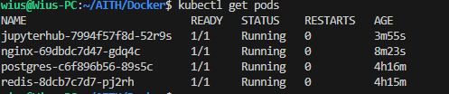
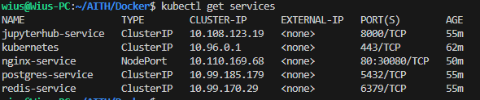
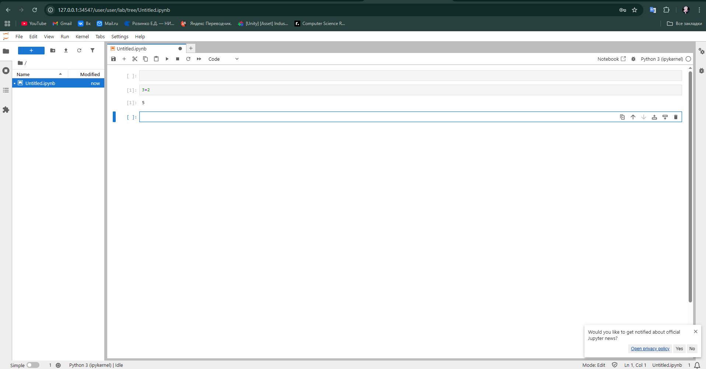

# Лабораторная работа 4: More Kubernetes

## Задание

Развернуть свой собственный сервис в Kubernetes, по аналогии с ЛР 3, используя сервисы из ЛР 2 (JupyterHub) (некоторые файлы просто взяты из ЛР 2).

## Архитектура

В данной работе развернута система JupyterHub со следующими компонентами:

1. **PostgreSQL** - база данных пользователей
   - Использует init контейнер для инициализации
   - Хранит данные в PersistentVolume
   - Имеет liveness и readiness пробы

2. **Redis** - кэш сессий
   - Использует PersistentVolume для хранения данных
   - Имеет liveness и readiness пробы

3. **JupyterHub** - основное приложение
   - Использует кастомный образ, собранный из Dockerfile
   - Имеет liveness и readiness пробы
   - Подключается к PostgreSQL и Redis

4. **Nginx** - reverse proxy
   - Предоставляет внешний доступ к JupyterHub
   - Использует NodePort для доступа из вне кластера

## Требования задания

- Минимум два Deployment (у нас 4: postgres, redis, jupyterhub, nginx)
- Кастомный образ для JupyterHub
- Init контейнер в PostgreSQL
- Volume для PostgreSQL и Redis
- ConfigMap и Secret для конфигурации
- Service для всех сервисов
- Liveness и readiness пробы
- Лейблы для всех ресурсов

## Развертывание

### Автоматическое развертывание (рекомендуется)

```bash
cd itmo-containers/4_lab
chmod +x deploy.sh
./deploy.sh
```

1. Проверит и запустит Minikube
2. Соберет кастомный образ JupyterHub
3. Применит все манифесты в правильном порядке
4. Дождется готовности всех сервисов
5. Выведет URL для доступа к JupyterHub

### Ручное развертывание

#### 1. Сборка кастомного образа JupyterHub

```bash
cd itmo-containers/4_lab
eval $(minikube docker-env)  # Для использования Docker в Minikube
docker build -t jupyterhub-custom:latest .
```

#### 2. Запуск Minikube

```bash
minikube start
minikube addons enable ingress
```

#### 3. Развертывание в Kubernetes

Порядок развертывания важен - сначала зависимости, затем сервисы:

```bash
# Создаем ConfigMaps и Secrets
kubectl apply -f postgres-configmap.yml
kubectl apply -f postgres-init-scripts.yml
kubectl apply -f redis-configmap.yml
kubectl apply -f jupyterhub-configmap.yml
kubectl apply -f nginx-configmap.yml

kubectl apply -f postgres-secret.yml
kubectl apply -f redis-secret.yml
kubectl apply -f jupyterhub-secret.yml

# Создаем PersistentVolumeClaims
kubectl apply -f postgres-pvc.yml
kubectl apply -f redis-pvc.yml

# Развертываем сервисы в порядке зависимостей
kubectl apply -f postgres-deployment.yml
kubectl apply -f postgres-service.yml

kubectl apply -f redis-deployment.yml
kubectl apply -f redis-service.yml

kubectl apply -f jupyterhub-deployment.yml
kubectl apply -f jupyterhub-service.yml

kubectl apply -f nginx-deployment.yml
kubectl apply -f nginx-service.yml
```

Или можно применить все файлы разом:

```bash
kubectl apply -f .
```

### 4. Проверка развертывания

```bash
# Проверяем статус подов
kubectl get pods

# Проверяем сервисы
kubectl get services

# Проверяем PVC
kubectl get pvc

# Смотрим логи при необходимости
kubectl logs -f deployment/postgres
kubectl logs -f deployment/redis
kubectl logs -f deployment/jupyterhub
kubectl logs -f deployment/nginx
```

### 5. Доступ к JupyterHub

После развертывания JupyterHub будет доступен по адресу:

```bash
minikube service nginx-service --url
```

### 6. Вход в JupyterHub

- Логин: user
- Пароль: any-password

## Скриншоты работы


*Развернутые поды в Kubernetes*


*Сервисы Kubernetes*


*JupyterHub интерфейс*


*Работа Jupyter Notebook*

## Очистка

Для удаления всех ресурсов:

```bash
kubectl delete -f .
```

